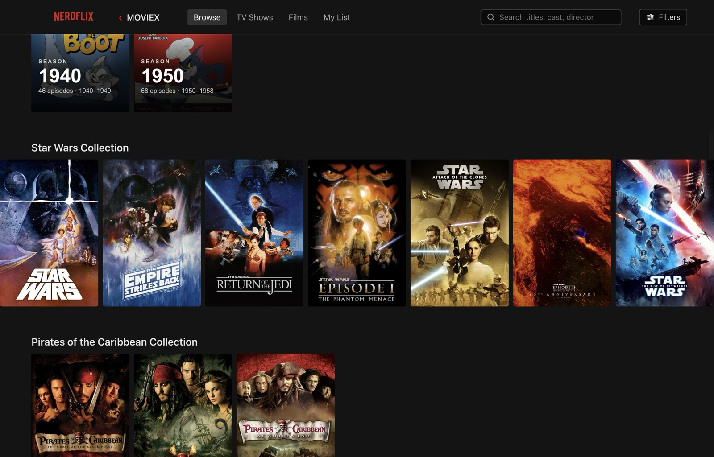
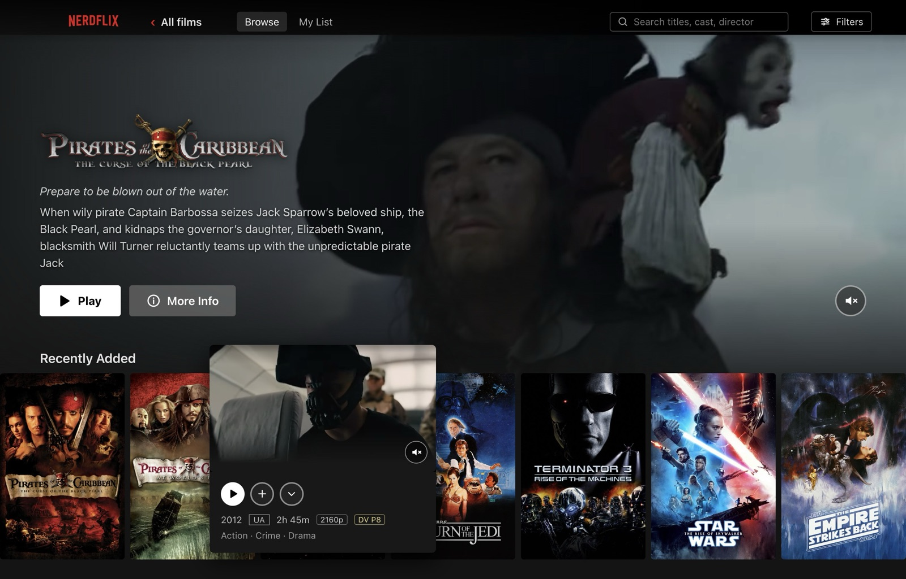
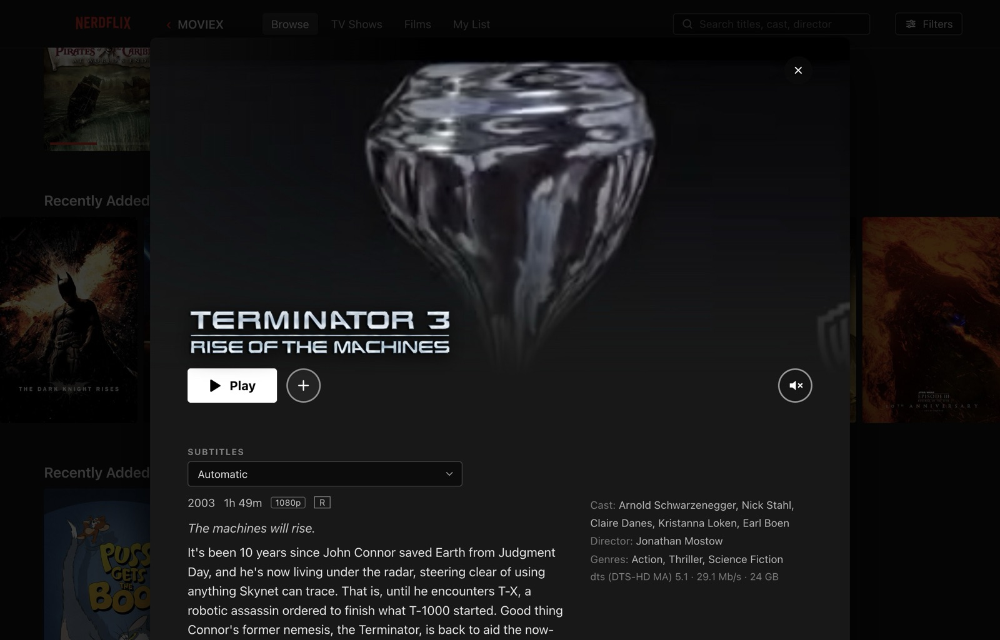
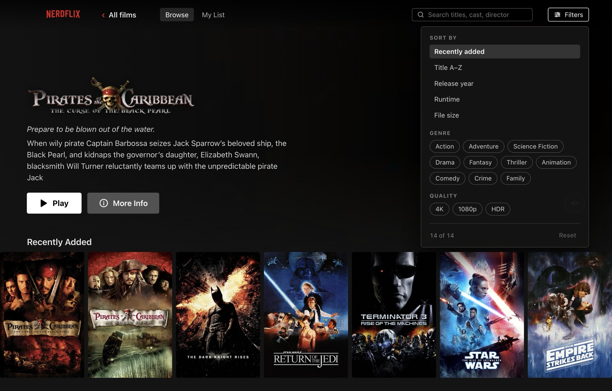
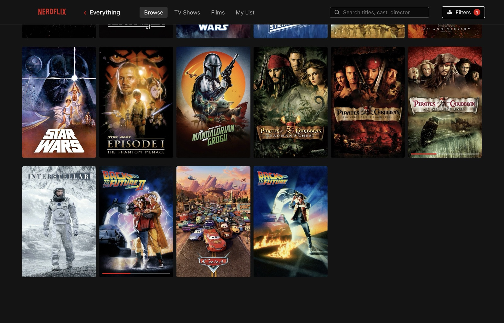
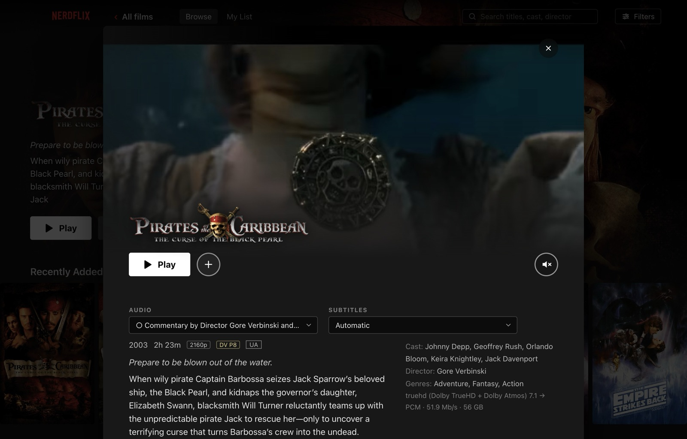
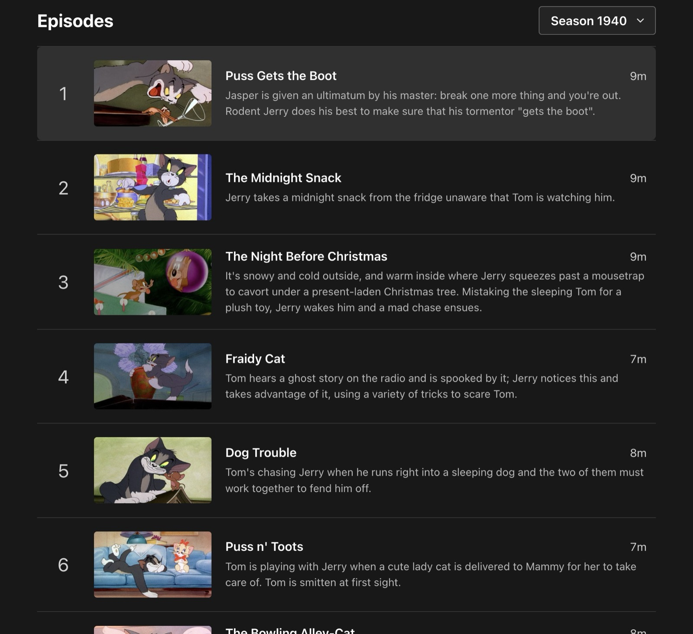

<div align="center">

# Nerdflix

**A Netflix-quality front end for the 4K Blu-ray remuxes on your own drives.**

Browse your library like a streaming service. Play it like an audiophile.

`macOS 14+` · `Apple Silicon` · `Electron + React + TypeScript` · `mpv / IINA` · `479 tests`

</div>


---

## Why this exists

Streaming services look wonderful and sound compressed. A 75 GB Blu-ray remux sounds
extraordinary and looks like a filename in Finder.

Nerdflix is the missing half: a browsing experience worth using, in front of files that
are already better than anything you can stream. **Nothing is transcoded, nothing is
re-encoded, and nothing is ever written to your drives.**

## What it does

- **Scans any folder depth** on internal disks, external SSDs and NAS shares, reading
  codecs, HDR format and audio layout from the stream with ffprobe — never from the
  filename.
- **Understands TV shows** — episodes grouped into series, seasons and episode lists
  with TMDB names, stills and synopses, and per-episode resume. Click an episode and
  exactly that one plays; the show's Play button picks up where you left off. Even a
  series TMDB only lists as individual films — the classic Tom and Jerry cartoons — gets
  a proper episode list.
- **Knows when you have finished** — a film or episode closed at its end credits counts
  as watched, because the file's own chapters say where the credits begin.
- **Fetches artwork, cast, synopses and trailers** from TMDB with your own free token,
  entered in the app.
- **Browses like a streaming service** — a hero billboard that plays trailers, rows,
  hover previews, a detail view, My List and Continue Watching with resume points.
- **Groups franchises automatically** into collection rows, in release order — and gives
  a show with several seasons a shelf of its own, one card per season with that
  season's poster, episode count and how far through it you are. Click a season and
  the detail view opens on it.
- **Keeps films and shows apart** where it matters: Recently Added Movies and Recently
  Added TV Shows are separate rows, with TV Shows and Films tabs besides.
- **Sorts and filters** by title, year, runtime, file size, genre, resolution, HDR,
  unwatched and availability.
- **Searches** across title, year, genre, director, creator and cast.
- **Picks the audio and subtitle track before the film starts**, with commentaries
  labelled, so a disc with four audio mixes and forty-seven subtitle tracks opens on the
  one you wanted. The choice is remembered per film.
- **Plays through mpv or IINA** with HDR passthrough, hardware decode and quality that
  adapts to your machine in both directions — then reports what actually happened rather
  than what was requested.
- **Catalogues drives you do not own** without writing a single byte to them. Unplug a
  drive and its films stay browsable; they just say where they are.

## What it looks like

|  |  |
|---|---|
| **The billboard plays.** Five seconds after the page settles, the hero's artwork gives way to the film's trailer — then hands over to the next film in *Recently Added* when it finishes, still → trailer → still → dissolve, rather than a cut. |  |
| **Franchises group themselves.** TMDB knows which films belong to a collection, so owning two or more of them makes a row — in release order, above the genre rows. No tagging, no folders, no network calls. |  |
| **Hover to preview.** The trailer plays where the poster was, and *keeps playing* when the card expands — one player that moves, never reloads. |  |
| **Detail view.** Logo, resume progress, technical truth about the file: real resolution, real HDR format, real audio layout and bitrate — all read from the stream. |  |
| **Sort and filter.** Facets come from your library, not a fixed list — a filter that cannot change the result is never offered, so nothing you press does nothing. |  |
| **Results are a grid.** Searching, filtering or sorting collapses the shelves into one ordered set, because the size of the answer is the point. |  |
| **Choose the track before you start.** A remux carries the feature mix, commentaries and dozens of subtitle tracks. Pick them here rather than hunting through a player menu while the opening plays. |  |
| **TV, episode by episode.** Seasons, TMDB's episode names, stills and synopses, and a Play button that means *the next one* — resume where you stopped, or the episode after the one you finished. Each episode has its own resume point. |  |
| **Your drives, as they are.** Per-drive cards plus a combined view whose counts are deduplicated — the same film on two drives is one film, not two. |  |

---

## Requirements

This is **v1, macOS only**, and deliberately so — the playback path depends on
VideoToolbox, CoreAudio and macOS volume semantics.

- macOS 14 or later, **Apple Silicon**
- Node 20 or later, and pnpm
- `mpv` for playback, or **IINA** (preferred — noticeably better HDR on Apple silicon)
- `ffprobe`, which comes with ffmpeg
- A free [TMDB read token](https://www.themoviedb.org/settings/api) for artwork and metadata

## Setup

### 1. Install what it drives

```bash
brew install ffmpeg mpv
brew install --cask iina          # optional but recommended — better HDR on Apple silicon
```

`ffmpeg` provides `ffprobe`, which is how every technical fact about a file is read.
`mpv` is the playback engine. IINA is optional and used automatically when present.

### 2. Get Nerdflix

**[Download the latest `.dmg`](https://github.com/iamdebasis/NERDFLIX/releases/latest)**,
open it, and drag Nerdflix to Applications.

The build is **not code-signed** — signing requires a paid Apple Developer account — so
the first launch needs **right-click → Open** rather than a double-click, then *Open* in
the dialog. macOS remembers the choice. Double-clicking an unsigned app instead shows
"cannot be opened because Apple cannot check it for malicious software", which looks
like a broken download but is just Gatekeeper.

<details>
<summary><b>Or run it from source</b></summary>

```bash
brew install node
npm install -g pnpm

git clone https://github.com/iamdebasis/NERDFLIX.git
cd NERDFLIX
pnpm install
pnpm app
```

`pnpm install` also downloads the Electron runtime (~280 MB) — the first install is slow,
later ones are not.

Check your machine has everything before going further:

```bash
pnpm run doctor     # note: 'run' is required — 'pnpm doctor' is pnpm's own command
```

It prints the versions of ffprobe, mpv and IINA it can actually see, the Electron
runtime's state, and which data directory is in use.

Building your own `.dmg` is `pnpm dist`, which writes to `apps/desktop/release/`.

</details>

### 3. Paste your TMDB token

The app asks on first run and stores it for you. **There is no config file to edit** —
in particular, do not put it in `.env.example`, which is a template that is never read.

[Create a free account](https://www.themoviedb.org/signup), then copy the **API Read
Access Token** from [Settings → API](https://www.themoviedb.org/settings/api). It is the
long one, not the short v3 key.

Without a token the app still scans and plays; you just get filenames instead of
posters.

### 4. Add a library

Everything from here is a button. **Add library** in the picker, choose the folder your
films are in, and the scan runs straight into fetching metadata and artwork. Nested
folders are walked to any depth, so pointing it at a drive root is fine.

TV shows live in the same library as films. Any of the usual layouts is recognised:

```
Breaking Bad/Season 1/Breaking.Bad.S01E01.Pilot.2160p.mkv   SxxEyy in the name
The.Office.US.S02.2160p.BluRay.REMUX/S02E01.mkv              series from the pack folder
Chernobyl/Season 1/01 - 1.23.45.mkv                          numbered, inside "Season N"
Tom and Jerry/Season 1940/S1940E01 - Puss Gets The Boot.mkv  a year as the season
```

A year or country suffix (`Doctor.Who.2005`, `The.Office.UK`) keeps a remake apart from
its original. Anything that does not clearly name a season and an episode stays a film.

Adding, rescanning, pruning and re-fetching artwork are all in the app. The CLI exists
for debugging and nothing requires it.

### 5. One step inside IINA

Skip this if you are using mpv.

`iina-cli` deliberately ignores `--input-*` flags, so the IPC socket cannot be passed per
launch. Open **IINA → Settings → Advanced**, tick *Enable advanced settings*, and add to
*Additional mpv options*:

```
input-ipc-server=/tmp/nerdflix-iina.sock
```

Then quit IINA. Without it, films still play but watch progress cannot be tracked — so
the app refuses to start that engine and tells you exactly what to paste, rather than
silently losing your resume points.

### Where your library lives

Everything the app writes lives in one directory — `db/` (derived, rebuildable by
rescanning), `state/` (watch history and My List, never regenerated), `cache/`
(disposable), and your `.env`.

| how you run it | where that is |
|---|---|
| from source | `data/` in the project folder |
| installed `.dmg` | `~/Library/Application Support/Nerdflix/data` |

Running from source, `data/` is gitignored — so **if you replace the project folder
rather than updating it in place, copy `data/` across first**, or point `NFL_DATA_DIR`
somewhere outside the project and it stops being a risk. `pnpm run doctor` prints which
directory is in use and which of those two situations you are in.

---

## The interesting parts

Most of this project is ordinary. These are not, and each came from something measured
contradicting the obvious guess.

### Files are identified by content, not location

The first design keyed media on `volume + path`. Both describe *where a file lives*, so
identity broke the moment the location was read-only (NTFS on macOS), borrowed, renamed
or copied. Borrowed media is not an edge case.

Identity now comes from a hash of the file's size, first and last megabyte, and
duration — two megabytes read whether the file is 5 GB or 80 GB. Location became an
observation:

```
Title
 └─ media[]           identified by contentId
     └─ sightings[]   { volumeId, relPath, fingerprint, lastSeen }
```

A file is not *on* a volume; it has *been seen* on volumes. That single inversion means
a friend's drive can be catalogued **without writing a byte to it**, a film copied to
your own disk is recognised on sight with its artwork intact, the same film on two
drives is one title rather than a duplicate, and renames cost nothing.

### Report what happened, not what was configured

A Dolby Vision remux was being flattened to SDR for weeks. The config said HDR was
enabled; nothing ever checked the result.

Every setting is a *request* the player may decline — hardware decode falls back, an HDR
hint can be refused by the compositor, a 7.1 track gets downmixed by the device. So the
status block reads every fact back after playback starts:

```
3840x2160 hevc 10-bit bt.2020
✓ HDR source HDR10 (PQ) bt.2020 graded for 4,000 nits · presented by the player
✓ hardware decode videotoolbox
audio dts 6ch → 2ch (stereo) downmixed via coreaudio
quality: High — 2160p on 16 GPU cores
```

It distinguishes three states a single "HDR: yes" cannot: passthrough working,
passthrough disabled, and passthrough *requested but declined*.

### Adding a field must not re-match anything

Collection rows needed one field that was already in every cached TMDB response and
simply never read. Backfilling it by re-running enrichment would have re-run the
*matcher* — and a title that matched correctly once must never quietly match something
else later.

Raw responses are cached verbatim for exactly this. A version stamp on each record marks
which derivation wrote it, and a stale record is re-derived from the cached JSON:
details only, no search, artwork and match verdict untouched. That is what makes it safe
to re-derive a title a human has confirmed — re-deriving is not re-matching.

The claim was checked rather than assumed, by running the backfill with a deliberately
**invalid** API token: 11 of 14 titles re-derived cleanly, and only the three still
awaiting review reached for the network and failed.

The bug found on the way was better than the feature. The CLI and the app each
pre-filtered which titles to enrich, with two rules that had drifted apart, and neither
agreed with the gate inside the function they called — so the first backfill ran, said
"3 of 14 titles", and did nothing at all. A caller-side filter that disagrees with the
callee's gate is how a migration silently no-ops.

The same shape turned up again, from the other direction, when the track picker needed
two fields ffprobe had never been asked for. Files are identified by a hash of their
content, and the rescan path used that to answer a second question it was never asked:
*do we already know everything about this file?* The bytes had not changed, so every
stored record was skipped and the rescan meant to collect the new fields reported all
fourteen "unchanged".

A version stamp on each record fixes it, and the re-probe is free — ffprobe has already
run, because the content hash needs the duration. **A cache key that means "the input
is unchanged" is not a licence to skip recomputing the output**, because the code doing
the deriving changes too. Twice now.

### One trailer player, moved rather than remounted

Hovering a card plays the film's trailer where the artwork was, it keeps playing when
the card expands into the detail view, and the hero runs its own billboard — all
streamed from YouTube, never stored.

There is exactly **one** preview player in the app, repositioned over whichever surface
claims it. An iframe cannot be moved in the DOM without reloading, so instead it never
moves and the box around it does.

The bugs were all about *ordering*, and none of them were visible in a screenshot:

- Releasing the player when a card unmounted looked safe, and was guarded with "release
  only if still ours". React runs an unmounting component's cleanup *before* the new
  component's effect, and the modal claims a frame later — so the player was unowned for
  one frame, the iframe was destroyed, and a minute of watching went back to zero.
- Fixing that with a deferred release introduced a subtler one: **StrictMode** runs every
  effect twice in development, so the modal scheduled a release *for itself* between its
  two mounts and then re-claimed under the identity that release was waiting for.
  Entitlement to release is now a token, not an identity.

Hiding YouTube's chrome needed two different measures for two different problems: the
top edge carries a title bar drawn at a **fixed** size, so it is cropped in pixels; the
bottom edge carries burned-in subtitles authored as a **share of the frame**, so it is
cropped proportionally. One constant could never clear both — it worked on the small
hover card and failed on the large modal, which was the whole diagnosis.

### A folder of films is not a file

Pairing a drive reported 4 films where there were 12. A folder holding more than one
feature was recorded as a `multiple-features` issue and skipped whole, on the assumption
it was a multi-part release — so a folder called *Star Wars Collection* contributed
nothing, and the only way to see those films was to pair the subfolder separately.

Discovery recurses now. The care is in *not* over-reaching, and the tests pin both
lessons: without a depth check, `1980s/Sci-Fi/Ridley Scott/Blade.Runner.mkv` produced a
film called **1980s**; with the depth check but no name check, it produced **Ridley
Scott**. A release folder needs one feature directly inside it *whose name the folder
describes*. Everything else is a shelf, and a shelf gets looked into.

### Star Wars Episode IV is not an episode

The obvious way to recognise TV is to ask a filename parser, and the popular one reads
`Star.Wars.Episode.4.A.New.Hope.1977` as episode 4 of a show called *Star Wars*, and a
`Season 01` folder as a show called *Season*. A film misread as an episode vanishes from
the film shelves, which is far worse than an episode left on them.

So the gate is strict and hand-written: an explicit `S01E04`, or `1x04` with a series
name, or a numbered file directly inside a folder that says which season it is. Nothing
else is an episode. The tests pin the films that must never parse as TV alongside the
episodes that must.

Grouping is conservative for the same reason. Episodes join a show by name; a year or a
country can only keep two apart, never pull them together. A show split in two is
visible and fixable. *The Office* (UK) merged into *The Office* (US) is not.

### A cartoon from 1940 is not a show from 2023

The classic Tom and Jerry shorts ship as a series — `Tom and Jerry - S1940E01 - Puss Gets
The Boot` — and TMDB has no series for them. Every "Tom and Jerry" TV entry there is a
later show, and the only one named exactly that began in 2023. To the matcher that looked
perfect: an exact name, no year to object, no rival. All 46 cartoons would have been
matched, automatically, to the wrong show.

The fix is one rule of the kind this project prefers — a year can only exclude: a series
cannot have episodes numbered by a year before it first aired. With the 2023 show ruled
out, each cartoon is matched as what TMDB says it is, a film: the title near-exact, the
release inside the season's decade, the runtime right. Two shorts called *The Night
Before Christmas* in the 1940s are told apart by who made them — the one by the same
directors as the rest of the series. Against the real pack, all 46 matched, and their
release dates came back in episode order without being asked to.

### A player saying nothing must not erase your history

Testing TV playback turned up the worst bug the project has had. mpv reports its
position as a property change; as a file unloads, that report arrives with *no value*.
It was recorded as a resume point of `undefined`, which made the saved state invalid —
and the loader treated one invalid entry as a corrupt file, started empty, and the next
write saved the empty slate over everything: watch history, My List, track choices.

It is fixed at four layers, because `state/` is the one directory nothing can
regenerate: the engines pass `null` rather than nothing, the caller ignores anything
that is not a finite number, the store refuses to write a non-position, and loading
salvages entry by entry — keeping everything valid, dropping only what is not, and
saving the original byte for byte beside it before anything is changed.

### Quality adapts in both directions

Render settings come from GPU cores *and* content resolution — 2160p is four times the
pixels of 1080p, and a machine that holds the top tier at 1080p drops ~6% of frames at
4K. A watchdog then measures real frame drops and adjusts.

Two bugs here were more interesting than the feature:

**It only ever demoted.** One bad sample — during a scan, with other apps loaded — wrote
a lower ceiling to disk and never revisited it. A 16-core M1 Pro ended up permanently
running the *lowest* tier. It now climbs back after sustained clean playback.

**The threshold was finer than the measurement.** At 24fps a 2-second sample is 48
frames, so a *single* dropped frame read as 2.1% against a 0.8% limit. One imperceptible
frame triggered a demotion. It now judges over a 10-second window.

### Knowing when to stop optimising

HDR through mpv was good but visibly short of IINA on an XDR display. Five
configurations were measured and rejected: passthrough signalling, asserted
`target-peak`, MoltenVK via `macvk`, mpv's native Metal backend, and explicit
`target-trc`/`target-prim`.

The difference was architectural. IINA hosts libmpv and draws frames itself, so it owns
the `CAMetalLayer` and sets `wantsExtendedDynamicRangeContent` directly; a standalone
mpv process can only ask the compositor indirectly.

So rendering is delegated to IINA and everything else is kept. Underneath, IINA *is*
mpv — the same JSON IPC drives it, so resume tracking, status reporting and quality
adaptation all keep working. Using the right tool beat winning the argument.

---

## Architecture

```
apps/desktop/          Electron main + preload + React renderer
packages/core/         scanner · schema · volumes · metadata store · TMDB enrichment
packages/player/       playback engines (mpv, IINA) + JSON IPC + quality tiers
packages/cli/          scan · play · enrich · library · volumes · doctor
data/                  db (derived) · state (yours) · cache (disposable)
```

The renderer never touches `fs`, `path` or `child_process` — all disk access crosses a
typed IPC boundary, and artwork is served through a registered `media://` protocol so
`webSecurity` stays on.

**Non-negotiables**, each earned the hard way and documented in [`CLAUDE.md`](CLAUDE.md)
with the measurement behind it:

- Never use HTML5 `<video>` for library playback — Chromium cannot demux MKV or decode
  TrueHD/DTS-HD MA.
- Never transcode. Ever.
- Never trust filenames for codecs, HDR or audio — ffprobe is authoritative.
- Never write to a scanned drive.
- Never pin mpv's audio output; its fallback chain is what recovers from a broken device.

[`ARCHITECTURE.md`](ARCHITECTURE.md) is the decision record, including what was tried and
rejected, so the same ground is not re-litigated.

## Commands

Everything here is optional — the app covers all of it.

```bash
pnpm app                  # the application, from source
pnpm dist                 # build an unsigned .dmg into apps/desktop/release/
pnpm run doctor           # verify ffprobe, mpv, IINA, Electron runtime, data directory
pnpm scan <path>          # scan a library root and print a report
pnpm enrich               # TMDB metadata and artwork
pnpm library [--review]   # list titles, availability, match warnings
pnpm play <file>          # play with a terminal scrubber and live diagnostics
pnpm test                 # 479 tests
pnpm typecheck
```

Regenerating the screenshots above, which is done by driving the real app rather than
posing it by hand:

```bash
pnpm app:debug            # terminal 1 — the app with its debugger open
pnpm screenshots          # terminal 2 — writes docs/screenshots/
```

## Testing

**479 tests**, run against real files and real behaviour rather than mocks — several
bugs here were only reproducible with genuine 4K HEVC and actual drive behaviour.

The discovery tests build real directory trees in a temp dir and scan them, including
the nested-collection case above. The reconciliation tests copy, rename and delete files
on disk to prove identity survives. The row, sort and filter tests exist because
ordering is their entire substance and none of it shows in a rendered frame — and the
trailer-ownership tests are each checked to still fail against the code they replaced,
because a regression test that passes either way is worth nothing. The TV tests keep a
list of films that must never be read as episodes beside the episodes that must, ingest
real ffmpeg-generated files, and replay the exact corrupted state file observed on a
real run to prove nothing valid in it is lost.

## Not built

Deliberately deferred, in rough priority order:

- **Scrub-preview thumbnails** — needs the `thumbfast` pattern (a second hidden mpv
  instance). A pre-generated sprite sheet is impossible on an 80 GB file.
- **Skip Intro** from MKV chapter markers.
- **A review queue** for titles TMDB matched wrongly.
- **The SQLite index** — disposable, and a few hundred titles resolve in memory
  instantly.

Playback happens in mpv's own window rather than inside the app. That is settled, not a
placeholder: two windows in two processes cannot be kept in agreement on macOS, and the
only correct fix is libmpv rendering inside Chromium via a native addon.

## Licence

[MIT](LICENSE)
