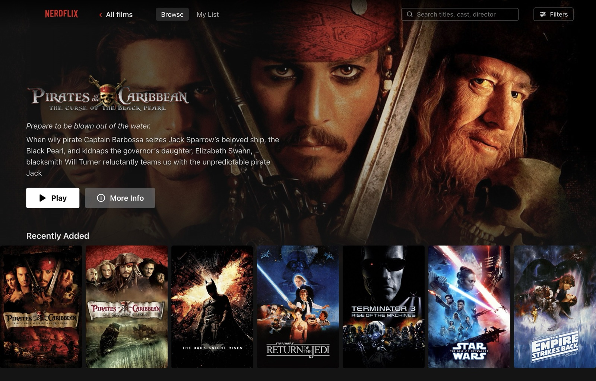
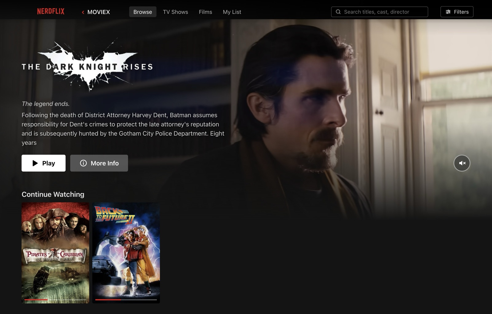
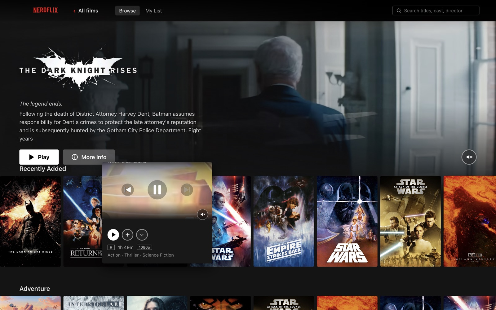
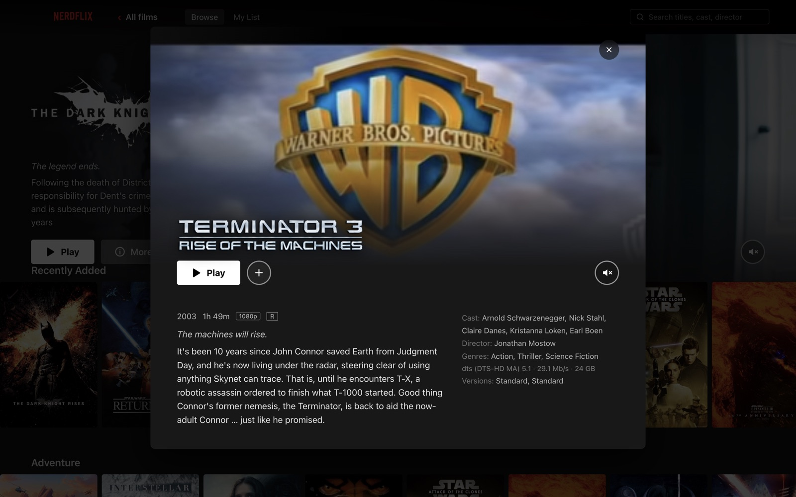
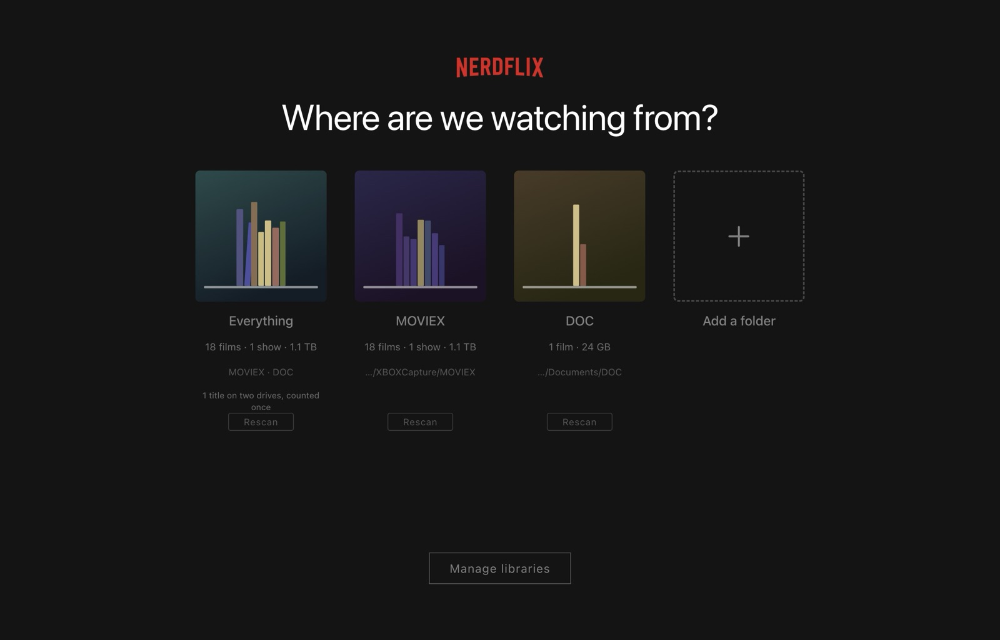

<div align="center">

# Nerdflix

**A Netflix-quality front end for the 4K Blu-ray remuxes on your own drives.**

Browse your library like a streaming service. Play it like an audiophile.

`macOS 14+` · `Apple Silicon` · `Electron + React + TypeScript` · `mpv / IINA` · `229 tests`

</div>



---

## Why this exists

Streaming services look wonderful and sound compressed. A 75 GB Blu-ray remux sounds
extraordinary and looks like a filename in Finder.

Nerdflix is the missing half: a browsing experience worth using, in front of files that
are already better than anything you can stream. **Nothing is transcoded, nothing is
re-encoded, and nothing is ever written to your drives.**

## What it looks like

|  |  |
|---|---|
| **The billboard plays.** Five seconds after the page settles, the hero's artwork gives way to the film's trailer — then moves to the next film in *Recently Added* when it finishes. |  |
| **Hover to preview.** The trailer plays where the poster was, and *keeps playing* when the card expands — one player that moves, never reloads. |  |
| **Detail view.** Logo, resume progress, technical truth about the file: real resolution, real HDR format, real audio layout — all read from the stream, never the filename. |  |
| **Your drives, as they are.** Per-drive cards plus a combined view. Unplugged drives stay browsable; their films just say where they are. |  |

## Requirements

This is **v1, macOS only**, and deliberately so — the playback path depends on
VideoToolbox, CoreAudio and macOS volume semantics.

- macOS 14 or later, **Apple Silicon**
- Node 20+ and pnpm
- `mpv` for playback, or **IINA** (preferred — noticeably better HDR on Apple silicon)
- `ffprobe`, which comes with ffmpeg
- A free [TMDB read token](https://www.themoviedb.org/settings/api) for artwork and metadata

## Quick start

```bash
brew install node ffmpeg mpv
brew install --cask iina          # optional but recommended
npm install -g pnpm
```

```bash
git clone https://github.com/iamdebasis/NERDFLIX.git && cd NERDFLIX
pnpm install
pnpm app
```

That is the whole setup. The app asks for your TMDB token on first run and stores it for
you — there is no config file to edit, and every other operation (adding a drive,
scanning, rescanning, pruning, fetching artwork) is a button in the app.

Check your machine has what it needs:

```bash
pnpm run doctor     # note: 'run' is required — 'pnpm doctor' is pnpm's own command
```

### One step inside IINA

`iina-cli` deliberately ignores `--input-*` flags, so the IPC socket cannot be passed per
launch. Open **IINA → Settings → Advanced**, tick *Enable advanced settings*, and add to
*Additional mpv options*:

```
input-ipc-server=/tmp/nerdflix-iina.sock
```

Then quit IINA. Without it, films still play but watch progress cannot be tracked — so
the app refuses to start that engine and tells you exactly what to paste, rather than
silently losing your resume points.

No IINA? Everything works with mpv instead.

### Where your library lives

Everything the app writes lives in one place: `data/` in the project root —
`db/` (derived), `state/` (watch history and My List, never regenerated), `cache/`
(disposable), and your `.env`.

It is gitignored, so **if you replace the project folder rather than updating it in
place, copy `data/` across first** — or point `NFL_DATA_DIR` somewhere outside the
project and it stops being a risk. `pnpm run doctor` prints which directory is in use.

---

## The interesting parts

Most of this project is ordinary. These are not, and each came from something measured
contradicting the obvious guess.

### Files are identified by content, not location

The first design keyed media on `volume + path`. Both describe *where a file lives*, so
identity broke the moment the location was read-only (NTFS on macOS), borrowed, renamed
or copied. Borrowed media is not an edge case.

Identity now comes from a hash of the file's size, first and last megabyte, and
duration — two megabytes read whether the file is 5 GB or 80 GB. Location became an
observation:

```
Title
 └─ media[]           identified by contentId
     └─ sightings[]   { volumeId, relPath, fingerprint, lastSeen }
```

A file is not *on* a volume; it has *been seen* on volumes. That single inversion means
a friend's drive can be catalogued **without writing a byte to it**, a film copied to
your own disk is recognised on sight with its artwork intact, the same film on two
drives is one title rather than a duplicate, and renames cost nothing.

### Report what happened, not what was configured

A Dolby Vision remux was being flattened to SDR for weeks. The config said HDR was
enabled; nothing ever checked the result.

Every setting is a *request* the player may decline — hardware decode falls back, an HDR
hint can be refused by the compositor, a 7.1 track gets downmixed by the device. So the
status block reads every fact back after playback starts:

```
3840x2160 hevc 10-bit bt.2020
✓ HDR source HDR10 (PQ) bt.2020 graded for 4,000 nits · presented by the player
✓ hardware decode videotoolbox
audio dts 6ch → 2ch (stereo) downmixed via coreaudio
quality: High — 2160p on 16 GPU cores
```

It distinguishes three states a single "HDR: yes" cannot: passthrough working,
passthrough disabled, and passthrough *requested but declined*.

### One trailer player, moved rather than remounted

Hovering a card plays the film's trailer where the artwork was, it keeps playing when
the card expands into the detail view, and the hero runs its own billboard — all
streamed from YouTube, never stored.

There is exactly **one** preview player in the app, repositioned over whichever surface
claims it. An iframe cannot be moved in the DOM without reloading, so instead it never
moves and the box around it does.

The bugs were all about *ordering*, and none of them were visible in a screenshot:

- Releasing the player when a card unmounted looked safe, and was guarded with "release
  only if still ours". React runs an unmounting component's cleanup *before* the new
  component's effect, and the modal claims a frame later — so the player was unowned for
  one frame, the iframe was destroyed, and a minute of watching went back to zero.
- Fixing that with a deferred release introduced a subtler one: **StrictMode** runs every
  effect twice in development, so the modal scheduled a release *for itself* between its
  two mounts and then re-claimed under the identity that release was waiting for.
  Entitlement to release is now a token, not an identity.

Hiding YouTube's chrome needed two different measures for two different problems: the
top edge carries a title bar drawn at a **fixed** size, so it is cropped in pixels; the
bottom edge carries burned-in subtitles authored as a **share of the frame**, so it is
cropped proportionally. One constant could never clear both — it worked on the small
hover card and failed on the large modal, which was the whole diagnosis.

### A folder of films is not a file

Pairing a drive reported 4 films where there were 12. A folder holding more than one
feature was recorded as a `multiple-features` issue and skipped whole, on the assumption
it was a multi-part release — so a folder called *Star Wars Collection* contributed
nothing, and the only way to see those films was to pair the subfolder separately.

Discovery recurses now. The care is in *not* over-reaching, and the tests pin both
lessons: without a depth check, `1980s/Sci-Fi/Ridley Scott/Blade.Runner.mkv` produced a
film called **1980s**; with the depth check but no name check, it produced **Ridley
Scott**. A release folder needs one feature directly inside it *whose name the folder
describes*. Everything else is a shelf, and a shelf gets looked into.

### Quality adapts in both directions

Render settings come from GPU cores *and* content resolution — 2160p is four times the
pixels of 1080p, and a machine that holds the top tier at 1080p drops ~6% of frames at
4K. A watchdog then measures real frame drops and adjusts.

Two bugs here were more interesting than the feature:

**It only ever demoted.** One bad sample — during a scan, with other apps loaded — wrote
a lower ceiling to disk and never revisited it. A 16-core M1 Pro ended up permanently
running the *lowest* tier. It now climbs back after sustained clean playback.

**The threshold was finer than the measurement.** At 24fps a 2-second sample is 48
frames, so a *single* dropped frame read as 2.1% against a 0.8% limit. One imperceptible
frame triggered a demotion. It now judges over a 10-second window.

### Knowing when to stop optimising

HDR through mpv was good but visibly short of IINA on an XDR display. Five
configurations were measured and rejected: passthrough signalling, asserted
`target-peak`, MoltenVK via `macvk`, mpv's native Metal backend, and explicit
`target-trc`/`target-prim`.

The difference was architectural. IINA hosts libmpv and draws frames itself, so it owns
the `CAMetalLayer` and sets `wantsExtendedDynamicRangeContent` directly; a standalone
mpv process can only ask the compositor indirectly.

So rendering is delegated to IINA and everything else is kept. Underneath, IINA *is*
mpv — the same JSON IPC drives it, so resume tracking, status reporting and quality
adaptation all keep working. Using the right tool beat winning the argument.

---

## Architecture

```
apps/desktop/          Electron main + preload + React renderer
packages/core/         scanner · schema · volumes · metadata store · TMDB enrichment
packages/player/       playback engines (mpv, IINA) + JSON IPC + quality tiers
packages/cli/          scan · play · enrich · library · volumes · doctor
data/                  db (derived) · state (yours) · cache (disposable)
```

The renderer never touches `fs`, `path` or `child_process` — all disk access crosses a
typed IPC boundary, and artwork is served through a registered `media://` protocol so
`webSecurity` stays on.

**Non-negotiables**, each earned the hard way and documented in [`CLAUDE.md`](CLAUDE.md)
with the measurement behind it:

- Never use HTML5 `<video>` for library playback — Chromium cannot demux MKV or decode
  TrueHD/DTS-HD MA.
- Never transcode. Ever.
- Never trust filenames for codecs, HDR or audio — ffprobe is authoritative.
- Never write to a scanned drive.
- Never pin mpv's audio output; its fallback chain is what recovers from a broken device.

[`ARCHITECTURE.md`](ARCHITECTURE.md) is the decision record, including what was tried and
rejected, so the same ground is not re-litigated.

## Commands

Everything below is optional — the app covers all of it.

```bash
pnpm app                  # the application
pnpm run doctor           # verify ffprobe, mpv, IINA, Electron runtime
pnpm scan <path>          # scan a library root and print a report
pnpm enrich               # TMDB metadata and artwork
pnpm library [--review]   # list titles, availability, match warnings
pnpm play <file>          # play with a terminal scrubber and live diagnostics
pnpm test                 # 229 tests
pnpm typecheck
```

## Testing

**229 tests**, run against real files and real behaviour rather than mocks — several
bugs here were only reproducible with genuine 4K HEVC and actual drive behaviour.

The discovery tests build real directory trees in a temp dir and scan them, including
the nested-collection case above. The reconciliation tests copy, rename and delete files
on disk to prove identity survives. The trailer-ownership tests exist because every bug
in that code was about *ordering*, which is invisible in a rendered frame — and each one
is checked to still fail against the code it replaced, because a regression test that
passes either way is worth nothing.

## Not built

Deliberately deferred, in rough priority order:

- **Scrub-preview thumbnails** — needs the `thumbfast` pattern (a second hidden mpv
  instance). A pre-generated sprite sheet is impossible on an 80 GB file.
- **Skip Intro** from MKV chapter markers.
- **A review queue** for titles TMDB matched wrongly.
- **The SQLite index** — disposable, and a few hundred titles resolve in memory
  instantly.

Playback happens in mpv's own window rather than inside the app. That is settled, not a
placeholder: two windows in two processes cannot be kept in agreement on macOS, and the
only correct fix is libmpv rendering inside Chromium via a native addon.

## Licence

[MIT](LICENSE)
